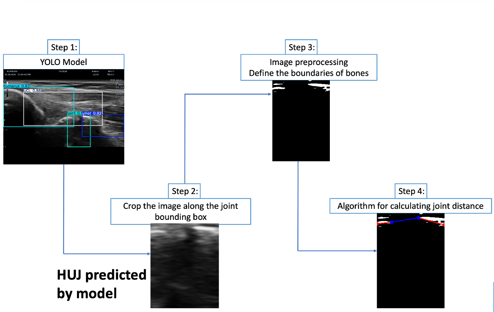

# Ultrasound Joint-Gap Measurement Pipeline
This repository implements a fully automated image-processing workflow for joint-gap estimation in ultrasound images.
It integrates:
- YOLO-based anatomical detection （output_image_frame_111.png）
- ROI extraction + preprocessing （output_image_frame_111_cropped.png）
- Adaptive thresholding + smoothing （output_image_frame_111_adaptive_threshold.png）
- Euclidean distance-based measurement and visualization （output_image_frame_111_processed.png）

## 🧩 Pipeline Flowchart

The full processing pipeline is illustrated below:

